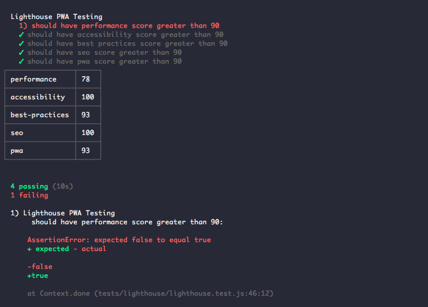

## lighthouse-mocha-example

Example using [lighthouse](https://github.com/GoogleChrome/lighthouse) and [chrome-launcher](https://github.com/GoogleChrome/chrome-launcher) for running lighthouse tests with mocha.

_**Note**: This example also uses `cli-table` to show data in a table format so it is easy to read the data while testing. It is not necessary that you use it since lighthouse supports HTML and JSON data output. For details on it, please read this [documentation](https://github.com/GoogleChrome/lighthouse#viewing-a-report)._

This works with CI environments too!

Also, you might want to run this on a production build since some metrics are not available during development.